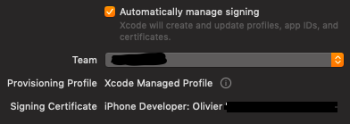

# 💻 Qt Mac CMake

CMake macro to deploy and create installer for Qt application on Mac.

## What it is

The project provide a cmake function that wrap [macdeployqt](https://github.com/probonopd/macdeployqt). You will need **macdeployqt** installed for the function to work.

It is designed to automate the process of creating a deployable application bundle that contains the Qt libraries as private frameworks.

The mac deployment tool also deploys the Qt plugins, according to the following rules (unless `-no-plugins` option is used):

- The platform plugin is always deployed.
- Debug versions of the plugins are not deployed.
- The designer plugins are not deployed.
- The image format plugins are always deployed.
- The print support plugin is always deployed.
- SQL driver plugins are deployed if the application uses the [Qt SQL](https://doc.qt.io/qt-5.9/qtsql-index.html) module.
- Script plugins are deployed if the application uses the [Qt Script](https://doc.qt.io/qt-5.9/qtscript-index.html) module.
- The SVG icon plugin is deployed if the application uses the [Qt SVG](https://doc.qt.io/qt-5.9/qtsvg-index.html) module.
- The accessibility plugin is always deployed.

The function help you create:

* A `<tgt>App` target that deploy dependencies.
* A `<tgt>Dmg` target that package the `.app` inside a `.dmg`.
* A `<tgt>Pkg` target that package the `.app` inside a `.pkg`.

To sign your app you need at least a team id and a signing identity. I recommand you to override those variable when doing the cmake command, and not writting them inside your cmake scripts. This will give you more control when configuring the project.

* `QT_MAC_TEAM_ID`: Same as `TEAM_ID` option, can be useful to specify at configure time, not in source code.
* `QT_MAC_CODE_SIGN_IDENTITY`: Same as `CODE_SIGN_IDENTITY` option, can be useful to specify at configure time, not in source code.
* `QT_MAC_PROVISIONING_PROFILE_SPECIFIER`: Same as `PROVISIONING_PROFILE_SPECIFIER` option, can be useful to specify at configure time, not in source code.

Use `Developer ID Application` for `dmg`.

Use `Apple Distribution` or `Mac Distribution` for `pkg`.

## Usage

```cmake
# Create:
# - MyTargetApp: Deploy every dylib, qml dependencies in the app.
# - MyTargetDmg: Build dmg from app (for distribution not in apple store)
# - MyTargetArchive: Export app in an archive (needed by pkg)
# - MyTargetPkg: Export app in pkg from archive (for apple store)
add_qt_mac_app(MyTarget
  ALL
  NAME "My App"
  BUNDLE_IDENTIFIER "com.company.app"
  # VERSION "1.2.3"
  # SHORT_VERSION "1.2.3"
  LONG_VERSION "1.2.3.456"
  # CUSTOM_PLIST "path/to/Info.plist.in"
  # CODE_SIGN_IDENTITY "Mac Developer"
  # TEAM_ID "AAAAAAAA"
  # PROVISIONING_PROFILE_SPECIFIER "my-profile"
  # ITS_ENCRYPTION_EXPORT_COMPLIANCE_CODE AAAAAAAAAAAAAAAAAA
  COPYRIGHT "My Cool Copyright"
  QML_DIR "${QT_IOS_QT_ROOT}/qml"
  # CATALOG_APPICON "AppIcon"
  DMG
  # DMG_FS "HFS+"
  PKG
  PKG_UPLOAD_SYMBOLS
  # PKG_DISTRIBUTION_METHOD "app-store"
  VERBOSE
  MAC_DEPLOY_QT_VERBOSE_LEVEL 3
  RESOURCES
    path/to/Assets.xcassets
    /additional/resource/1
    /other/resource
  DEPENDS
    target1
    target2
)
```

Then run cmake with Xcode generator:

```bash
export Qt5_DIR=/Users/username/Qt/5.15.1/clang_64

# Development (you might need to fix stuff inside Xcode)
cmake -G "Xcode" ..

# Development (with automatic signing)
cmake \
-G "Xcode" \
-DQT_MAC_CODE_SIGN_IDENTITY="Apple Development" \
-DQT_MAC_TEAM_ID=AAAAAAAA \
..

# Distribution (Apple Store)
cmake \
-G "Xcode" \
-DCMAKE_OSX_DEPLOYMENT_TARGET=10.13 \
-DQT_MAC_CODE_SIGN_IDENTITY="Apple Distribution" \
-DQT_MAC_PROVISIONING_PROFILE_SPECIFIER=profilename.app \
-DQT_MAC_TEAM_ID=AAAAAAAA \
..

# Distribution (Dmg)
cmake \
-G "Xcode" \
-DCMAKE_OSX_DEPLOYMENT_TARGET=10.13 \
-DQT_MAC_CODE_SIGN_IDENTITY="Developer ID Application" \
-DQT_MAC_PROVISIONING_PROFILE_SPECIFIER=profilename.devid \
-DQT_MAC_TEAM_ID=AAAAAAAA \
..
```

Qt Support minimum osx vsersion:

| Qt Version | Minimum OSX Version |
| ---------- | ------------------- |
| 5.12       | 10.12               |
| 5.15       | 10.13               |

**NAME**

The bundle display name is the name displayed underneath the application icon. This value should be localized for all supported languages. If not given, the name of the source target is taken. The default is `${TARGET}`. This is the name displayed on the os. This is the equivalent of the **Display Name** field under *General* XCode.

*Example:*

```cmake
add_qt_ios_app(MyApp
    NAME "My App"
)
```


**BUNDLE_IDENTIFIER**

The application bundle identifier. A bundle identifier lets iOS and macOS recognize any updates to your app. Your bundle ID must be registered with Apple and be unique to your app. Bundle IDs are app-type specific (either iOS or macOS). The same bundle ID cannot be used for both iOS and macOS apps.

Bundle identifiers are usually (not always) written out in reverse DNS notation (`com.myCompany.myApp`).

If not specified, the default value is `${CMAKE_PROJECT_NAME}.${TARGET}`.

*Example:*

```cmake
add_qt_ios_app(MyApp
    BUNDLE_IDENTIFIER "com.myCompany.myApp"
)
```


**VERSION**

The string that specifies the build version number of the bundle. This value is a monotonically increased string, comprised of one or more period-separated integers. This value can correspond to either released or unreleased versions of the application. This value cannot be localized. The default is `${CMAKE_PROJECT_VERSION}` is set, otherwise  `1.0.0`.

*Example:*

```cmake
add_qt_ios_app(MyApp
    VERSION "1.2.3"
)
```


**SHORT_VERSION**

The release version of the application. The value of this key is a string comprised of three period-separated integers. This is default to **VERSION**.

*Example:*

```cmake
add_qt_ios_app(MyApp
    SHORT_VERSION "1.2.3"
)
```

**LONG_VERSION**

The release version of the application that usualy include the build number. This is default to **VERSION**.

*Example:*

```cmake
add_qt_ios_app(MyApp
    LONG_VERSION "1.2.3"
)
```

**CUSTOM_PLIST**

It is possible to specify a custom pList file. The default is `Info.plist.in`. CMake include a basic template [here](https://github.com/Kitware/CMake/blob/master/Modules/MacOSXBundleInfo.plist.in). Qt also add some recommendation, read more about it [here](https://doc.qt.io/qt-5/ios-platform-notes.html). The file in this repository is a variant of the CMake ones that have more configurable field from CMake. If you use your own `plist.in` some feature of this macro won't work anymore. Don't forget to copy in your file:

*Example:*

```cmake
add_qt_ios_app(MyApp
    CUSTOM_PLIST "path/to/Info.plist.in"
)
```

The pList file can also be a file that isn't gonna be configured it's gonna work the same way.

**CODE_SIGN_IDENTITY**

Code signing is required in order to deploy to real ios device (ie non simulator). More info [here](https://developer.apple.com/support/code-signing/). *By default "Mac Developer".* Possible values are:

```bash
"Mac Developer"            # For development
"Mac Distribution"         # For appstore distribution
"Apple Distribution"       # For appstore distribution
"Developer ID Application" # For dmg distribution
```

*Example:*

```cmake
add_qt_ios_app(MyApp
    CODE_SIGN_IDENTITY "Mac Developer"
)
```

**TEAM_ID**

The team id used to sign the application. *By default "AAAAAAAA."*

You can see possible values by executing:

```bash
/usr/bin/env xcrun security find-identity -v -p codesigning
```

*Example:*

```cmake
add_qt_ios_app(MyApp
    TEAM_ID "AAAAAAAA"
)
```



**PROVISIONING_PROFILE_SPECIFIER**

A provisioning profile can be generated [there](https://developer.apple.com/account/resources/profiles/list).
If not specified, signing profile will be generated by cmake. Suitable for development but not for distribution.
The `BUNDLE_IDENTIFIER` should match the on the the provisioning profile.

A profile hold a Certificate for an App ID for a Team Id.

**COPYRIGHT**

Set the copyright in the info.plist. *Optional*

*Example:*

```cmake
add_qt_ios_app(MyApp
    COPYRIGHT "Cool Copyright 2019"
)
```

**APPLICATION_CATEGORY_TYPE**

Category of the application for the [AppStore](https://developer.apple.com/documentation/bundleresources/information_property_list/lsapplicationcategorytype).

Default is `public.app-category.developer-tools`.

**QML_DIR**

Used to link with qml libs. By default it is set to qt sdk qml dir but you can specify your own.

*Example:*

```cmake
add_qt_ios_app(MyApp
    QML_DIR "path/to/qml"
)
```

**RESOURCES**

List of files and folder to add to the resources.

**CATALOG_APPICON**

Specify the AppIcon folder inside your Assets folder. *By Default "AppIcon".*


**PKG**

If specified, two additional target are going to be generated.

- `<MyApp>Archive` that generate `MyApp.xcarchive`.
- `<MyApp>Pkg` that generate `MyAppPkg/MyApp.pkg`.

Pkg file is the format required by App Store Connect. It can be uploaded straight to TestFlight.

When specifying `PKG`, additionnal parameters are available:

- `PKG_UPLOAD_SYMBOLS` : Pack symbols inside the pkg. Useful when having a crash report.
- `PKG_DISTRIBUTION_METHOD` : Only `app-store` is supported for know.

| PKG_DISTRIBUTION_METHOD |                          Info                          |
| :---------------------: | :----------------------------------------------------: |
|        app-store        | For apple store deployment. This is the default value. |
|      developer-id       |                      Not tested.                       |
|       development       |                      Not tested.                       |
|     mac-application     |                      Not tested.                       |
|       validation        |                      Not tested.                       |

`PKG_DISTRIBUTION_METHOD` can be overwritten at configure time by specifying a `-DQT_MAC_PKG_DISTRIBUTION_METHOD="ad-hoc"` for example.

**ITS_ENCRYPTION_EXPORT_COMPLIANCE_CODE**

The export compliance code provided by App Store Connect for apps that require it. This will add a key [ITSEncryptionExportComplianceCode](https://developer.apple.com/documentation/bundleresources/information_property_list/itsencryptionexportcompliancecode) in Info.plist.

If not provided (means you don't need it), it will create a key [ITSAppUsesNonExemptEncryption](https://help.apple.com/xcode/mac/current/#/dev0dc15d044) to false.

This is required by Apple Connect. If this key doesn't exist in your Info.plist, you will need to fix this in Apple TestFlight website when uploading the PKG.

**NO_STRIP**

Don't run 'strip' on the binaries

**NO_PLUGINS**

 Skip plugin deployment

**DMG**

Create a .dmg disk image

**DMG_FS**

Set the filesystem used for the .dmg disk image (defaults to HFS+)

**Note:** macOS High Sierra introduced the new Apple File System (APFS). Older versions of macOS cannot read .dmg files that are formatted with APFS. By default, `macdeployqt` uses the older HFS+ file system for compatibility with all versions of macOS currently supported by Qt. Use the `-fs` option to specify a different file system.

**VERBOSE**

Print all debug information. Usefull to check if configuration is ok.

**MAC_DEPLOY_QT_VERBOSE_LEVEL**

For `macdeployqt` 0 = no output, 1 = error/warning (default), 2 = normal, 3 = debug.


## Examples

The project [QaterialGallery](https://github.com/OlivierLDff/QaterialGallery) show usage.
